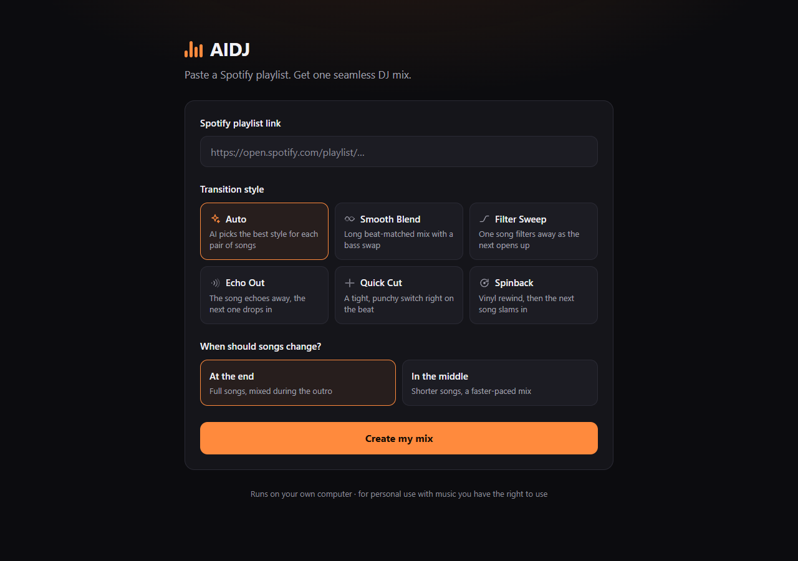
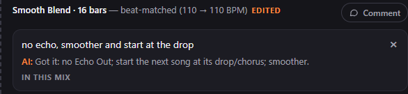

# AIDJ – turn a Spotify playlist into a DJ mix

Paste a link to a Spotify playlist, choose how you want the songs to change, and AIDJ builds **one continuous DJ mix** you can play in the browser or download as an MP3.

It works like a real DJ would: it finds the tempo and the beats of every song, lines the beats up, waits for the right moment in the music, and then blends, filters, echoes, cuts or spins into the next song.



---

## What you can choose

**Transition style** – how one song turns into the next:

| Style | What it sounds like |
|---|---|
| **Auto** | The AI picks the best style for every pair of songs (based on their tempo and musical key). |
| **Smooth Blend** | Both songs play together, perfectly in time, and the bass lines swap halfway. The classic club mix. |
| **Filter Sweep** | The old song slowly gets thinner and fades away while the new one opens up from a muffled sound. |
| **Echo Out** | The old song echoes away and the new one drops in right on the beat. |
| **Quick Cut** | A tight, punchy switch on the first beat of a new bar. |
| **Spinback** | The old song is rewound like a vinyl record, then the new one slams in. |

**When songs change:**

- **At the end** – you hear the full songs, the mix happens during each song's ending.
- **In the middle** – each song plays for about half its length, for a shorter, faster-paced mix.

Everything else (where exactly to mix, for how long, tempo matching, EQ, effects) is decided automatically.

> Smooth Blend and Filter Sweep need two songs with similar tempos. When two songs are too far apart, AIDJ uses an Echo Out instead and tells you why in the tracklist.

---

## What you need

- A computer with **Windows, macOS or Linux**
- **Python 3.10 or newer** – download it from [python.org](https://www.python.org/downloads/).
  On Windows, tick **"Add python.exe to PATH"** in the installer.
- An internet connection
- A **public** Spotify playlist (or album)

You do **not** need a Spotify account, a Spotify API key or ffmpeg. Everything else is installed for you.

---

## How to start it

### Windows (easiest)

1. Download this project: click the green **Code** button on GitHub, then **Download ZIP**, and unzip it.
   (Or use `git clone https://github.com/dyzerds/AIDJ.git`.)
2. Double-click **`start.bat`**.
3. The first start installs everything (a minute or two). Then your browser opens AIDJ at **http://127.0.0.1:5050**.

Keep the black window open while you use AIDJ. Close it (or press `Ctrl + C`) to stop.

### macOS / Linux

Open a terminal in the project folder and run:

```bash
python3 -m venv .venv
source .venv/bin/activate
pip install -r requirements.txt
python app.py
```

Your browser opens **http://127.0.0.1:5050**. Next time you only need the `source …` and `python app.py` lines.

---

## How to use it

1. In Spotify, open your playlist, click **Share → Copy link to playlist**.
2. Paste the link into AIDJ.
3. Pick a transition style and when the songs should change.
4. Click **Create my mix** and wait. You can watch the progress: downloading, analysing, mixing.
5. Press play, click any time in the tracklist to jump to that song, or click **Download MP3**.
6. Want a transition done differently? Leave a comment on it ([see below](#change-a-transition-with-a-comment)).

The first mix of a playlist takes a few minutes, because every song has to be downloaded and analysed.
Mixing the same playlist again (for example with another style) is much faster, because songs are kept on your computer.

---

## Change a transition with a comment

Not happy with one transition? Every transition in the tracklist has a **Comment** button.

1. Click **Comment** under the transition and write what you want, in plain English.
2. The AI answers right away with what it understood, for example *"Got it: switch to Spinback; next song 1.5 dB louder."*
3. Comment on as many transitions as you like, then press **Re-mix with my comments**.

Your comments stay with the mix, so you can keep fine-tuning it. Remove a comment with **×** and re-mix again.



| You can write things like… | What the AI does |
|---|---|
| "use an echo", "spinback here", "just crossfade" | Switches to that technique |
| "no spinback", "not the filter" | Avoids that technique |
| "longer", "a bit shorter", "16 bars", "10 seconds" | Changes how long both songs play together |
| "earlier", "start 8 bars later", "cut the outro" | Moves the transition |
| "in the middle", "let the song finish" | Changes where in the song it happens |
| "start the next song at the chorus", "skip the intro" | Starts the next song at its drop / chorus |
| "smoother", "too abrupt" | A longer, softer transition |
| "punchier", "more energy" | A hard cut right on the beat |
| "the beats clash", "out of sync" | The songs don't overlap at all |
| "muddy", "too much bass" | Less overlap, filters instead of a full blend |
| "next song too loud", "a bit louder" | Changes the volume of the next song |
| "more echo", "less echo" | A longer or shorter echo tail |
| "you decide", "reset" | Lets the AI choose again / forgets your comments on that transition |

If the AI doesn't understand a comment, it says so and shows examples. Some wishes are impossible, like a Smooth Blend
between songs whose tempos are far apart. Then the AI picks the closest option and explains why in the tracklist.

---

## Where are my files?

| Folder | What is in it |
|---|---|
| `mixes/` | Every mix you made, as MP3 files. |
| `library/` | The downloaded songs and their analysis, so the next mix is faster. |

You can delete either folder at any time to free up space. AIDJ re-creates them when needed.

---

## How it works (the short version)

1. **Read the playlist** – AIDJ reads the song list from Spotify's public playlist page.
2. **Download** – it finds each song on YouTube Music and downloads the audio.
3. **Listen** – for every song it measures the tempo (BPM), places a beat grid on the drums, finds the first beat of every bar, the musical key, how loud the song is and where its sections (intro, chorus, outro) change.
4. **Plan** – for every pair of songs it chooses the transition, picks a moment on a phrase boundary (every 4 or 8 bars, like a DJ counts), and works out how much to speed up or slow down the next song so the beats match. Songs are time-stretched without changing their pitch, and they glide back to their own tempo after the blend.
5. **Mix** – it renders the transitions (EQ bass swap, filter sweeps, tempo-synced echo, vinyl spinback), evens out the volume of all songs, runs a limiter so nothing distorts, and saves one MP3.
6. **Listen to you** – your comments are turned into changes (technique, length, timing, where the next song starts, volume…) and the mix is planned and rendered again.

Main files:

| File | Job |
|---|---|
| `app.py` | The website and the background job that makes the mix |
| `downloader.py` | Reads the Spotify playlist and downloads the songs |
| `analysis.py` | Tempo, beats, bars, key, loudness and song sections |
| `mixer.py` | Plans and renders every transition |
| `comments.py` | Understands your comments on transitions |
| `static/index.html` | The web page |
| `selftest.py` | A self-check that needs no internet |

---

## Check that everything works

```bash
python selftest.py
```

It creates a few test songs, analyses them and makes mixes with every style. It ends with `ALL CHECKS PASSED`.
(On Windows use `.venv\Scripts\python selftest.py` after the first start.)

---

## Troubleshooting

- **"Spotify could not find that playlist"** – the playlist must be public. Albums work too.
  Very long playlists are read up to the first 100 songs.
- **Some songs are "left out"** – AIDJ could not find them on YouTube Music. The mix is made without them.
- **Downloads fail** – YouTube changes often. Update the downloader with
  `pip install -U "yt-dlp[default]"` (`start.bat` does this for you).
  Installing [Node.js](https://nodejs.org) or [Deno](https://deno.com) can also help, AIDJ uses them when they are installed.
- **"AIDJ is already running"** – AIDJ is already open in another window, so use that one.
  Just updated AIDJ? Close the old AIDJ window first, then start it again.
- **"Port 5050 is used by another program"** – close that program, or change `PORT` in `app.py`.
- **Python not found on Windows** – reinstall Python and tick **"Add python.exe to PATH"**.

---

## Please note

AIDJ is for **personal use**. Only download and mix music you have the right to use, and respect the rules of
Spotify, YouTube and the artists. The mixes are made on your own computer and are not uploaded anywhere.
